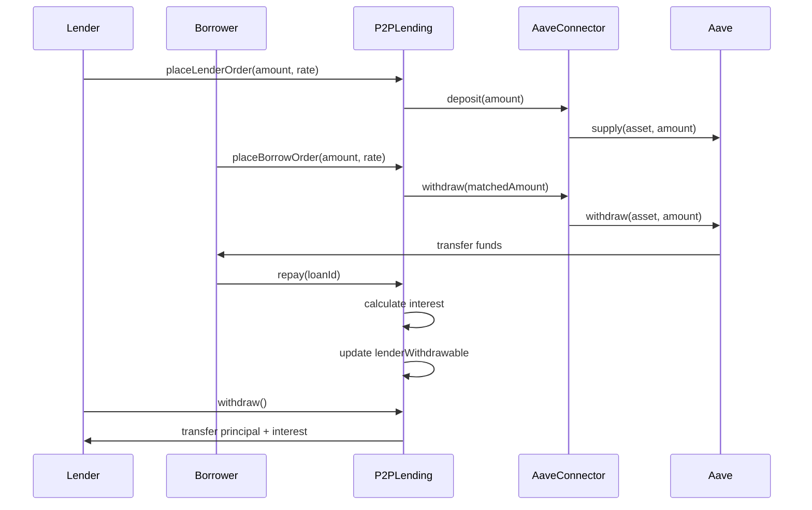

# Gas-Efficient P2P Lending Matching Engine with Aave Integration

A decentralized P2P lending protocol on Ethereum that matches lenders and borrowers on-chain and deposits unmatched lender liquidity into Aave for yield. Built with Foundry and Solidity 0.8.20.
This design mirrors real-world DeFi primitives such as Aave and on-chain order books, while prioritizing gas efficiency and correctness.

---

## Features

- **Order-book style queues**: Lenders and borrowers submit orders with amount and rate (bps); matching is rate-then-time priority.
- **Gas-efficient queues**: Bucketed by rate (25 bps steps), bitset for non-empty buckets, linked-list FIFO per bucket (no array shifting).
- **Aave integration**: Unmatched lender funds are supplied to Aave; on match or cancel, only the needed amount is withdrawn.
- **Partial fills**: Orders can be partially filled; remainder stays in queue until filled or cancelled.
- **Repay & withdraw**: Borrowers repay principal (and interest); lenders withdraw via pull pattern.
- **Yield-aware accounting**: Share-based system ensures lenders earn proportional Aave yield on unused liquidity.

## Project Structure

```
src/
├── core/
│ ├── P2PLending.sol # Main protocol: orders, matching, repay, withdraw
│ └── AaveConnector.sol # Wraps Aave supply/withdraw; only callable by P2PLending
├── interfaces/
│ ├── IPool.sol # Minimal Aave V3 Pool (supply, withdraw)
│ └── IAToken.sol # Minimal aToken interface
├── libraries/
│ └── OrderTypes.sol # LenderOrder, BorrowOrder, LoanPosition structs; BUCKET_SIZE_BPS
└── mocks/
├── MockERC20.sol # ERC20 with mint (for tests)
└── MockAavePool.sol # Mock Aave pool for tests
test/
└── P2PLending.t.sol # Unit tests (place, match, cancel, repay, withdraw, reverts)
```
## Flow Diagram



## Data Structure Design

### Order types (OrderTypes.sol)

- **LenderOrder**: `owner`, `amount`, `minRateBps`, `createdAt`, `remaining` (packed: uint128/uint32 where possible).
- **BorrowOrder**: `owner`, `amount`, `maxRateBps`, `createdAt`, `remaining`.
- **LoanPosition**: `lender`, `borrower`, `principal`, `rateBps`, `startTime`.

Rates are in basis points (bps); 10000 = 100%.

### Queues (gas-efficient)

- **Rate buckets**: Rate is bucketed as `rateBps / 25` (BUCKET_SIZE_BPS). Bucket index capped at 255.
- **Bitset**: One `uint256` per queue (lender/borrow) marks which buckets are non-empty so we never scan empty buckets.
- **FIFO per bucket**: Each bucket is a linked list: `headOrderId`, `tailOrderId`, `orderId → nextOrderId`. Enqueue at tail; dequeue from head; no array shifts.

### Matching logic

- **matchOrders(maxItems)**: At most `maxItems` matches per call (bounded gas).
- **Lender side**: Take the **lowest** non-empty lender bucket (lowest min rate first).
- **Borrower side**: Take the **highest** non-empty borrow bucket (highest max rate first).
- **Match condition**: `lender.minRateBps <= borrower.maxRateBps`. Fill amount = `min(lender.remaining, borrower.remaining)`.
- **After fill**: Update `remaining`; if 0, dequeue. Create `LoanPosition`. Withdraw fill amount from Aave and send to borrower.

### Interest Model

Loans use **simple interest**, calculated at repayment time:

```solidity
interest = principal * rateBps * timeElapsed / (10000 * 365 days);
```

- Interest accrues linearly from `startTime`
- Repayment is **full repayment only** (no partial repayments)
- Borrowers must repay `principal + interest` in one transaction
- After repayment, the loan is deleted from storage

This keeps accounting simple and gas-efficient.

## Aave Integration Flow

1. **Lender deposits**: User approves P2PLending → `placeLenderOrder(amount, minRateBps)` → P2PLending pulls tokens → approves AaveConnector → AaveConnector pulls from P2PLending and calls `pool.supply(asset, amount, connector, 0)`. aTokens accrue to the connector.
2. **Match**: When `matchOrders` finds a match, P2PLending calls `connector.withdraw(fillAmount, borrower)` → connector calls `pool.withdraw(asset, amount, borrower)`; borrower receives underlying asset.
3. **Lender cancel**: P2PLending calculates `assetsOut` from the lender’s shares and calls `connector.withdraw(assetsOut, lender)`, ensuring the lender receives principal + accrued yield.

(Optional: add a sequence diagram here if you use a tool like Mermaid.)

## Yield & Share Accounting

The protocol uses a **share-based accounting model** to track each lender’s proportional ownership of pooled Aave liquidity.

- When a lender deposits, they receive shares:
  - If `totalShares == 0`: `shares = assets * SHARES_SCALE`
  - Otherwise: `shares = assets * totalShares / totalAssets`
- Total shares track ownership of the entire Aave position.
- As Aave yield accrues, `totalAssets` increases while `totalShares` stays constant.
- This causes each share to represent more underlying assets over time.

### Matching Impact

- When a loan is matched, shares corresponding to the matched amount are **burned**.
- Remaining shares continue earning yield in Aave.

### Cancel Behavior

- On cancel, shares are converted back to assets:
  - `assets = shares * totalAssets / totalShares`
- This ensures lenders receive:
  - **Principal + accrued yield**

This mirrors real DeFi protocols like Aave and Yearn.

## Gas-Saving Choices

- **Packed structs**: uint128 for amounts, uint32 for rate/timestamp to use storage slots efficiently.
- **Custom errors**: Instead of long `require` strings (e.g. `InvalidAmount()`, `Unauthorized()`).
- **Bounded loops**: `matchOrders(maxItems)` caps work per call.
- **No full-queue iteration**: Bitset + per-bucket linked list; we only walk non-empty buckets and list heads.
- **Single bitset per queue**: 256 buckets in one word; set/clear with bit ops.
- **Pull-based withdraw**: Lenders call `withdraw()` to claim; avoids push and gas spikes.
- **Efficient bucket selection**:
  - Bitset tracks non-empty buckets
  - Selection scans over a bounded range (max 256 buckets)
  - Avoids unbounded iteration and ensures predictable gas cost

## Testing & Validation

The test suite validates the full protocol lifecycle:

- **Deposit → Aave**: Ensures funds are supplied correctly
- **Partial match**: Only matched portion is withdrawn from Aave
- **Yield accrual**: `vm.warp` simulates time → Aave balance increases
- **Cancel with yield**: Lenders receive more than principal after time
- **Repayment with interest**: Lenders receive principal + interest
- **End-to-end flow**: Deposit → Match → Repay → Withdraw

All tests pass using Foundry (`forge test`).

## Gas Report

### P2PLending Contract

| Function              | Min Gas | Avg Gas | Median Gas | Max Gas | # Calls |
|----------------------|--------:|--------:|-----------:|--------:|--------:|
| placeLenderOrder     | 26,856  | 335,393 | 388,364    | 388,364 | 16      |
| placeBorrowOrder     | 165,231 | 165,231 | 165,231    | 165,231 | 9       |
| matchOrders          | 42,058  | 161,228 | 178,110    | 197,135 | 8       |
| cancelLenderOrder    | 28,880  | 83,437  | 90,925     | 106,145 | 5       |
| repay                | 28,929  | 71,309  | 85,436     | 85,436  | 4       |
| withdraw             | 39,109  | 39,109  | 39,109     | 39,109  | 2       |

### AaveConnector Contract

| Function      | Min Gas | Avg Gas | Median Gas | Max Gas | # Calls |
|--------------|--------:|--------:|-----------:|--------:|--------:|
| totalAssets  | 11,123  | 12,086  | 11,123     | 14,013  | 12      |

### Notes

- `matchOrders` uses bucketed matching with bounded iteration → predictable gas usage
- Gas varies depending on:
  - Partial vs full fills
  - Number of iterations (`maxItems`)
- `placeLenderOrder` includes:
  - ERC20 transfer
  - Aave deposit
  - Share minting logic
- `cancelLenderOrder` cost varies due to:
  - Share → asset conversion
  - Linked-list removal (O(n) within bucket worst case)
- `repay` is cheaper when interest is small (short time elapsed)

## Usage

### Build

```bash
forge build
```
### Test

```bash
forge test
```

### Gas report

```bash
forge test --gas-report
```

## Deploy (example with mocks)

Deploy order: MockERC20 → MockAavePool → AaveConnector(pool, asset, P2PLending address) → P2PLending(asset, connector). Use CREATE2 or a factory to get the P2PLending address before deploying the connector, since the connector’s protocol must be the final P2PLending address.

## Security

- ReentrancyGuard on external state-changing functions.
- Pull-based lender withdrawals.
- onlyProtocol on AaveConnector so only P2PLending can deposit/withdraw.

## Design Trade-offs

- **Simple interest vs compound**:
  - Used simple interest for gas efficiency and deterministic repayment
- **Full repayment only**:
  - Avoids complexity of partial repayment accounting
- **Linked-list queues**:
  - Enables O(1) insertion/removal without array shifting
- **Share-based accounting**:
  - Adds complexity but enables correct yield distribution

## License

MIT


---
